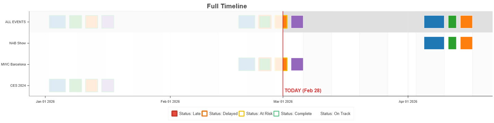
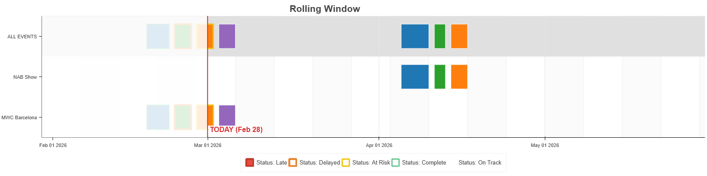

# Project Timeline Generator

This tool generates interactive Gantt-chart style timelines from Excel data using Python and [Bokeh](https://bokeh.org/). It is designed to visualize project schedules, tracking status, phases, and key dates with a clean, professional aesthetic.

## Features

- **Interactive HTML Output:** Generates standalone HTML files with zoom, pan, and hover tooltips.
- **Dual Views:**
  - **Full Timeline:** Visualizes the entire project duration.
  - **Rolling Window:** Focuses on a specific window (default: 30 days past to 90 days future) to highlight immediate concerns.
- **Status Visualization:** Events are styled based on their status (e.g., Late, At Risk, On Track) with specific border colors and fill styles.
- **Phase Grouping:** Tasks are color-coded by "Task/Phase" to distinguish between different work streams.
- **Visual Context:**
  - **Today Marker:** A red line indicating the current date.
  - **Past Shading:** A transparent overlay dims past dates.
  - **Banded Columns:** Vertical stripes help track weeks visually.

## Sample Output

### Full Timeline


### Rolling Window


## Prerequisites

- Python 3.x
- `pandas`
- `openpyxl`
- `bokeh`

## Installation

1. Clone this repository.
2. Install the required dependencies:

```bash
pip install -r requirements.txt
```

*(Note: Ensure your requirements file is named correctly. If the provided file is named `requriements.txt`, please rename it to `requirements.txt` or adjust the command above).*

## Usage

### 1. Prepare Data
Ensure your Excel file follows the required format (see **Data Format** below). The default location the script looks for is `data/events.xlsx`.

### 2. Run the Script
To run with the default file path:
```bash
python timeline.py
```

To run with a specific Excel file:
```bash
python timeline.py "path/to/your/project_data.xlsx"
```

### 3. View Results
The script will generate HTML files in the `outputs/` folder and automatically attempt to open the folder. Open the HTML files in your web browser to view the timeline.

## Data Format

The input Excel file requires the following columns:

| Column | Description |
| :--- | :--- |
| `Event Name` | The label for the task or event. |
| `Start` | Start date (Date format). |
| `End` | End date (Date format). |
| `Task/Phase` | Used for base color coding (e.g., "Planning", "Execution"). |
| `Status` | Determines the border/style (see Status Key below). |
| `Include` | Set to "Yes" to include the row in the plot. |

### Status Key
The visualization applies specific styles based on the **Status** column:

- **Late:** Red border, Red fill.
- **Delayed:** Orange border, Phase color fill.
- **At Risk:** Yellow border, Phase color fill.
- **Complete:** Green border, Phase color fill.
- **On Track:** White border, Phase color fill.